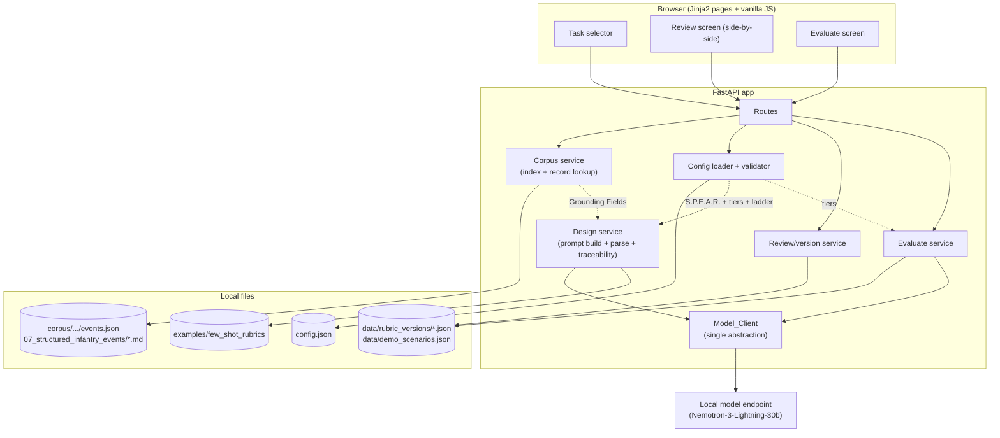

# Design Document

## Overview

This design describes a **2-day hackathon prototype** of the T&R Rubric Evaluation Generator: a local web application covering two ADDIE stages — **Design** (generate a structured performance rubric from a Training & Readiness task standard) and **Evaluate** (score an observed performance against an approved rubric). It is built by a two-person, non-software-engineering team and optimized for speed-to-demo and operational simplicity over architectural completeness.

The full AWS/ADDIE production architecture (Bedrock multi-agent orchestration, five knowledge bases, Neptune, multi-tenant IAM, GovCloud, offline-first PWA) is an explicit post-event roadmap and is **out of scope** (Req 7). Analyze, Develop, and Implement are named as future phases only.

### Chosen stack (and why)

| Concern | Choice | Rationale |
|---|---|---|
| Language | **Python 3.11+** | The team can read/operate it; rich stdlib for file/JSON/YAML; trivial local run. |
| Web framework | **FastAPI** + **Uvicorn** | Minimal boilerplate, built-in JSON handling, auto request validation via Pydantic, one-command local run. |
| Data validation | **Pydantic v2** | Enforces the fixed Rubric Schema and config shape; gives clean parse errors (Req 2 AC 9, Req 5). |
| Front end | **Server-rendered HTML (Jinja2) + a little vanilla JS** | No build step, no SPA toolchain to operate. Side-by-side review and inline edit are simple DOM. |
| Markdown front matter | **python-frontmatter** (or manual split) | Reads event record YAML front matter + body. |
| Model call | **httpx** to an OpenAI-compatible local endpoint | Single client module; one-line endpoint/model swap. |
| Persistence | **Local JSON files** under `data/` | No DB to provision (Req 8 AC 2); human-readable; easy to back up for the recorded-demo fallback. |

**Assumptions stated explicitly:**
- The local model endpoint (Nemotron-3-Lightning-30b) exposes an **OpenAI-compatible `/v1/chat/completions`** interface. If it differs, only the Model_Client body changes (Req 6 AC 4). Endpoint URL/model name come from environment variables with sensible defaults.
- Single-user demo. No auth, no concurrency control beyond simple file writes. Approvals/versions are local.
- The corpus lives at `corpus/work/fireteam-forge-corpus/` (verified). A single `CORPUS_ROOT` constant points there so it can be relocated in one place.

## Architecture



**Data flow (happy path):**
1. **Design**: selector loads from `events.json` (3500.44D only) → user picks an event → exact file lookup → extract Grounding Fields → build prompt (Grounding Fields + config S.P.E.A.R./BARS scaffold + few-shot examples) → Model_Client → parse to Rubric Schema → traceability check → render Review screen.
2. **Review**: SME edits/approves/rejects per KST → soft traceability gate on lock → immutable Rubric Version saved to `data/`.
3. **Evaluate**: pick approved version → enter/paste performance description or choose a demo scenario → Model_Client scores per KST/tier → structured result + plain-language summary + provenance caveat.

## Configuration file

`config.json` at project root. Read once at startup and per request (cheap; supports live edits during a demo). S.P.E.A.R. dimensions and their definitions live **only** here — never retrieved from the corpus (Req 9).

```json
{
  "rubric_tiers": [
    { "name": "Unsatisfactory", "value": 1 },
    { "name": "Satisfactory",   "value": 2 },
    { "name": "Proficient",     "value": 3 }
  ],
  "competency_levels": ["Foundation", "Intermediate", "Expert"],
  "spear_dimensions": [
    { "name": "Speed",             "definition": "How quickly the task is performed to standard under the given conditions." },
    { "name": "Precision",         "definition": "Accuracy and correctness of execution against the standard." },
    { "name": "Executive Control", "definition": "Decision-making, sequencing, and self-regulation during execution." },
    { "name": "Adaptability",      "definition": "Adjustment to changing or degraded conditions while maintaining the standard." },
    { "name": "Risk Exposure",     "definition": "Degree to which the performance manages or increases risk to self, unit, and mission." }
  ]
}
```

> The S.P.E.A.R. definitions above are the **team's own working definitions**, entered as config. They are NOT sourced from the corpus. `01_core/JMAP_SPEAR_PUBLIC_SOURCE_MAP.md` records that the ONR S.P.E.A.R. Model of Lethality and Lethality Report were never publicly available, so no corpus text defines them (Req 9, Req 10).

**Validation behavior (`ConfigLoader`):**
- Missing file or invalid JSON → error "configuration could not be loaded" (Req 5 AC 6).
- `spear_dimensions` absent → error "S.P.E.A.R. configuration is required" (Req 9 AC 4).
- Any of `rubric_tiers`, `competency_levels`, `spear_dimensions` present but empty/zero-length → error naming the invalid section (Req 5 AC 7).
- Enforced with a Pydantic model (`AppConfig`) so shape errors are precise.

## Model_Client abstraction

Single module `model_client.py`. All inference (Design and Evaluate) routes through `generate_structured(...)` (Req 6 AC 1).

```python
# model_client.py  — the ONLY place model/endpoint selection lives (Req 6 AC 4)
DEFAULT_MODEL = os.getenv("MODEL_NAME", "nemotron-3-lightning-30b")
ENDPOINT_URL  = os.getenv("MODEL_ENDPOINT", "http://localhost:8000/v1/chat/completions")

class ModelError(Exception): ...          # unreachable / HTTP error (Req 8 AC 4)
class ModelParseError(Exception): ...      # output not valid against schema (Req 2 AC 9)

def generate_structured(system_prompt: str,
                        user_prompt: str,
                        schema: type[BaseModel],
                        *, model: str = DEFAULT_MODEL) -> BaseModel:
    """POST to an OpenAI-compatible endpoint, request JSON, validate against `schema`.
    Raises ModelError if the endpoint is unreachable; ModelParseError if the
    response cannot be validated against `schema`."""
```

- **Swap for the final demo run**: change `MODEL_NAME` (Super-120b / Ultra-550b) or `MODEL_ENDPOINT` (GenAI.mil, DGX Spark). One-line/env change, no calling-code edits (Req 6 AC 3, AC 4).
- **Structured output**: prompt instructs strict JSON; response parsed and validated with the Pydantic `schema`. On validation failure → `ModelParseError` surfaced as a UI error (Req 2 AC 9). One bounded retry with a "return valid JSON only" reminder before failing.
- **Unreachable endpoint**: connection/timeout → `ModelError` → UI message "the model could not be reached" (Req 8 AC 4).

## Data models

**Event Index entry** (from `events.json`; verified fields):
```
event_code, title, functional_area, event_level, file,
has_condition, has_standard, has_components_or_steps
```
Note: the index has **no** `source_publication`/`source_date`/`source_currency`.

**Structured Event Record** (`07_structured_infantry_events/<file>`):
- Front matter: `event_code, title, functional_area, event_level, source_publication, source_date, source_currency, classification`
- **Grounding Fields** (body H2 sections used for generation + traceability): `## Condition`, `## Standard`, `## Performance Steps` (Req 2 AC 1).

**Rubric Schema** (per KST — the fixed generation shape, Req 2 AC 2):
```json
{
  "kst_id": "string",
  "statement": "string",
  "competency_level": "Foundation|Intermediate|Expert (from config)",
  "spear_dimension": "one of config spear_dimensions.name",
  "tier": "one of config rubric_tiers.name",
  "behavioral_anchor": "string",
  "traceable_to_source": { "traceable": "yes|no", "supporting_excerpt": "string|null" }
}
```
A generated **Rubric** is the set of KSTs plus a Task Attributes header (T&R Code, Echelon, Sustainment Interval, Condition, Standard, Key Performance Steps, Reference) and per-dimension Observable Metric text (Req 2 AC 8).

**Rubric Version** (immutable snapshot on lock):
```
version_id, event_code, created_at, task_attributes,
ksts[] (rejected KSTs excluded — Req 3 AC 7),
provenance { source_publication, source_date, source_currency },
acknowledged_untraceable: bool
```

**Evaluation Result**:
```
rubric_version_id, performance_description,
scores[] { kst_id, spear_dimension, tier_awarded, rationale },
summary (plain language),
provenance_caveat (string — always present, Req 4 AC 7)
```

## Design stage flow

1. **Task selector** (`CorpusService.list_tasks`): read `events.json`; present `event_code — title`. The list is derived from the index (Req 1 AC 1-2). The 3500.44D restriction (Req 1 AC 3) is evaluated against each record's `source_publication`; since all 538 records are 3500.44D this excludes nothing today but guards future corpora. To avoid opening 538 files on load, the selector lists all index entries and the restriction is enforced at selection time (record is opened then, front matter checked; non-3500.44D → excluded with a message). This keeps startup fast for the demo.
2. **Exact lookup** (`CorpusService.load_record`): `record_path = CORPUS_ROOT / "07_structured_infantry_events" / entry.file`. No search/keyword/fuzzy/vector matching (Req 1 AC 5). Missing/unreadable file → error (Req 1 AC 6).
3. **Show source** + `source_currency`/`source_date` before generation (Req 1 AC 7-8).
4. **Prompt build** (`DesignService.build_prompt`):
   - Source text = **Grounding Fields only** (Condition, Standard, Performance Steps).
   - Scaffold = S.P.E.A.R. dimensions + definitions **from config** + BARS tier scaffold from config (Req 9 AC 3).
   - Few-shot = 1-2 hand-written example rubrics from `examples/` (Req 2 AC 1).
   - **Project-context exclusion**: the corpus service only ever reads from `07_structured_infantry_events/`; `00_project_context/` is never a retrieval source (Req 10 AC 3). There is no code path that reads that folder for generation.
5. **Generate + parse**: `Model_Client.generate_structured(..., schema=RubricModel)` → parse to Rubric Schema; failure → error (Req 2 AC 9).
6. **Traceability check**: for each behavioral anchor, compare against the Grounding Fields; set `traceable_to_source.traceable` yes (with excerpt) or no (Req 2 AC 6-7, Req 10 AC 4). The model is asked to self-report the supporting excerpt; the app verifies the excerpt substring appears in the Grounding Fields before accepting `yes`.

## Review screen

- **Side-by-side**: left = source standard (Grounding Fields + Task Attributes), right = generated KSTs (Req 3 AC 1).
- **Inline edit** any KST field (Req 3 AC 2); edits saved to the working draft.
- **Approve/reject per KST** (Req 3 AC 3).
- **Visual distinction**: `traceable_to_source=no` KSTs highlighted (e.g., amber row + flag icon) (Req 3 AC 4).
- **Provenance**: `source_currency`/`source_date` shown, plus the non-hideable **Provenance Caveat** on the rubric (Req 2 AC 10-12).
- **Soft traceability gate on lock**: if any anchor is still `no`, warn and list them; SME must tick "I acknowledge these untraceable anchors" to proceed (Req 3 AC 5). Without acknowledgment, lock is refused (Req 3 AC 6).
- **Lock**: rejected KSTs excluded (Req 3 AC 7); a `Rubric Version` is written and becomes immutable (Req 3 AC 8-9).

## Evaluate stage flow

1. List approved `Rubric Version`s (Req 4 AC 1). If none → message "an approved rubric is required" (Req 4 AC 8).
2. Enter/paste a performance description (Req 4 AC 2) or pick a **Demo Scenario** (Req 4 AC 3, Req 8 AC 3).
3. `EvaluateService.score`: `Model_Client.generate_structured(..., schema=EvaluationModel)` with the locked rubric + performance description (Req 4 AC 4).
4. Produce a **structured score per KST/tier** (Req 4 AC 5) + a **plain-language summary** (Req 4 AC 6).
5. Attach the **Provenance Caveat** to the result (Req 4 AC 7).

## Persistence

Local JSON files (Req 8 AC 2), human-readable and easy to back up:
- `data/rubric_versions/<version_id>.json` — immutable approved rubrics.
- `data/demo_scenarios.json` — at least one prewritten scenario (Req 8 AC 3), e.g. a "Conduct Observation (0300-CMBH-1001)" performance narrative.
- `data/drafts/<event_code>.json` (optional) — in-progress review drafts so a demo can resume after a reload.

Rationale: no DB to provision or operate; the whole `data/` folder plus a screen recording is the recorded-backup path if the live model misbehaves on stage.

## Components and Interfaces

The app is a small set of single-responsibility Python modules behind FastAPI routes. Each maps directly to requirements.

- **`ConfigLoader` (`config.py`)** — `load() -> AppConfig`. Reads and validates `config.json` (Req 5, Req 9 AC 4). Raises typed errors for missing file, unparseable JSON, empty sections, and missing S.P.E.A.R.
- **`CorpusService` (`corpus.py`)**
  - `list_tasks() -> list[EventIndexEntry]` — parse `events.json` (Req 1 AC 1-2).
  - `load_record(event_code) -> EventRecord` — resolve `CORPUS_ROOT/07_structured_infantry_events/<file>` by exact `file` field; enforce 3500.44D via front matter; extract Grounding Fields (Req 1 AC 3-8). Only ever reads `07_structured_infantry_events/` — never `00_project_context/` (Req 10 AC 3).
- **`Model_Client` (`model_client.py`)** — `generate_structured(system_prompt, user_prompt, schema, *, model) -> BaseModel`. Sole inference path; sole location of model/endpoint selection (Req 6). Raises `ModelError` (Req 8 AC 4), `ModelParseError` (Req 2 AC 9).
- **`DesignService` (`design.py`)**
  - `build_prompt(record, config, few_shots) -> (system, user)` — Grounding Fields + config-only S.P.E.A.R./BARS scaffold + few-shot (Req 2 AC 1, Req 9 AC 3).
  - `generate(record, config) -> Rubric` — call Model_Client, parse to Rubric Schema, run traceability check (Req 2 AC 2-9, Req 10 AC 4).
- **`ReviewService` (`review.py`)** — `edit_kst`, `set_kst_status`, `lock(draft, acknowledged) -> RubricVersion`. Soft gate + rejected-KST exclusion + immutability (Req 3 AC 2-9).
- **`EvaluateService` (`evaluate.py`)** — `list_versions()`, `score(version, performance_description) -> EvaluationResult` with provenance caveat (Req 4).
- **`Store` (`store.py`)** — read/write `data/rubric_versions/*.json`, `data/demo_scenarios.json`, `data/drafts/*.json` (Req 8 AC 2-3).
- **Routes (`main.py`)** — FastAPI + Jinja2 pages: `/` (task selector), `/design/{event_code}`, `/review/{event_code}` (side-by-side), `/lock`, `/evaluate`, `/evaluate/score`.

### Interface contracts

- Every Model_Client caller passes a Pydantic `schema`; the returned object is guaranteed schema-valid or an error is raised (no partially-valid rubrics reach the UI).
- `CorpusService` returns Grounding Fields as a typed object; `DesignService` is the only consumer that feeds them into a prompt, keeping the "source vs generated" boundary in one place (Req 10 AC 1-2).
- `ReviewService.lock` refuses to produce a `RubricVersion` when untraceable anchors exist and `acknowledged` is false (Req 3 AC 5-6).

## Error Handling

| Case | Requirement | Handling |
|---|---|---|
| No matching / unreadable record file | Req 1 AC 6 | Error: source record could not be loaded |
| Non-3500.44D event selected | Req 1 AC 3 | Excluded from selection with a message |
| Model output not schema-valid | Req 2 AC 9 | One bounded retry, then `ModelParseError` → UI error |
| Model endpoint unreachable | Req 8 AC 4 | `ModelError` → "the model could not be reached" |
| Config missing/unparseable | Req 5 AC 6 | Error: configuration could not be loaded |
| Config section empty | Req 5 AC 7 | Error naming the invalid section |
| S.P.E.A.R. config missing | Req 9 AC 4 | Error: S.P.E.A.R. configuration is required |
| Lock with untraceable anchors, no ack | Req 3 AC 6 | Lock refused until acknowledged |
| Evaluate with no approved rubric | Req 4 AC 8 | Message: approved rubric required |

## Integrity boundaries (judging: Security & Sustainability)

- **Provenance caveat is unconditional.** Every generated rubric and every evaluation result carries the public-proxy caveat drawn from `source_currency`. It cannot be dismissed (Req 2 AC 11-12, Req 4 AC 7). This is honest about working from 3500.44D as a proxy for the controlled 3500.44E.
- **S.P.E.A.R. is config-only.** The corpus is never queried for S.P.E.A.R. definitions; there is no code path that would let the model cite corpus text as a S.P.E.A.R. source (Req 9). The single retrieval source for generation is `07_structured_infantry_events/`.
- **Source vs generated separation.** Corpus content is always "traceable source," never treated as pre-made rubric material; `traceable_to_source` is verified by substring-checking the model's claimed excerpt against the Grounding Fields (Req 10).
- **Project context excluded.** `00_project_context/` is never a retrieval source for generation (Req 10 AC 3).

## Correctness Properties

These invariants must hold regardless of model output or user input:

### Property 1: Single retrieval source
Rubric generation reads source text only from `07_structured_infantry_events/`. `00_project_context/` and S.P.E.A.R. corpus material are never a generation input.
**Validates: Requirements 9.1, 9.2, 9.3, 10.3**

### Property 2: S.P.E.A.R. comes only from config
The S.P.E.A.R. dimensions/definitions in any prompt are exactly those in `config.json`.
**Validates: Requirements 9.1, 9.3**

### Property 3: Observable metrics are anchored to performance steps
Each Observable Metric is generated against the task's ordered Performance Steps, with S.P.E.A.R. as the phrasing lens. A metric is `step_derived=yes` with a `step_ref` only when it corresponds to a Performance Step; a metric tied to no step is flagged `step_derived=no`.
**Validates: Requirements 2.2, 2.3, 2.6, 2.7, 10.4**

### Property 4: Locked versions are immutable and exclude rejected KSTs
After lock, a `RubricVersion` never changes and contains no rejected KST.
**Validates: Requirements 3.7, 3.8, 3.9**

### Property 5: No lock past an unacknowledged flag
A rubric with any `traceable_to_source=no` anchor cannot lock without explicit acknowledgment.
**Validates: Requirements 3.5, 3.6**

### Property 6: Provenance caveat always present
Every generated rubric and every evaluation result carries the caveat; it cannot be removed.
**Validates: Requirements 2.11, 2.12, 4.7**

### Property 7: Config-driven structure
Tier names/count, competency ladder, and S.P.E.A.R. dimensions used in both stages come from config, never hardcoded.
**Validates: Requirements 5.1, 5.2, 5.3, 5.5**

## Testing Strategy

Lightweight and focused on the risky seams; do not over-engineer. (Tests are not auto-added during implementation unless requested.)
- **Config validation**: valid, missing, empty-section, missing-S.P.E.A.R. cases.
- **Corpus lookup**: index parse; exact file resolution; missing-file error; Grounding Field extraction from a real record.
- **Schema parsing**: a known-good model JSON parses; malformed JSON raises `ModelParseError`.
- **Traceability check**: excerpt present in Grounding Fields → yes; absent → no.
- **Version lock**: rejected KSTs excluded; untraceable-without-ack refused.
- Model calls are mocked in tests; the live endpoint is exercised only in manual demo runs.

## Future phases / production roadmap (deferred — Req 7)

Analyze, Develop, and Implement, and the full AWS architecture (Bedrock multi-agent orchestration, five segmented knowledge bases, Neptune, DynamoDB, Cognito role groups, offline-first PWA, AppConfig, GovCloud/compliance) are **not built here**. They are the team's documented post-event roadmap and will be named as "future phases" in the UI and README, pointing to the attached architecture document.
