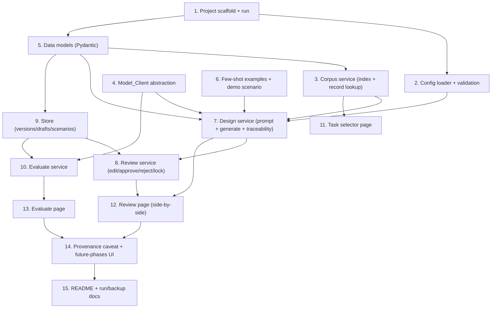

# Implementation Plan

## Overview

This plan implements the T&R Rubric Evaluation Generator hackathon prototype: a local FastAPI + Jinja2 web app covering the Design and Evaluate ADDIE stages, backed by local JSON files and a single swappable Model_Client. Tasks are ordered so foundational modules (config, corpus, model client, data models) land before the services that consume them, and pages come after their services. Each task cites the requirements it satisfies. Tests are not auto-added; the Testing Strategy in the design is exercised manually unless tests are explicitly requested.

## Task Dependency Graph



```json
{
  "waves": [
    { "wave": 1, "tasks": ["1"] },
    { "wave": 2, "tasks": ["2", "5", "4", "6"] },
    { "wave": 3, "tasks": ["3"] },
    { "wave": 4, "tasks": ["7", "9"] },
    { "wave": 5, "tasks": ["8", "10", "11"] },
    { "wave": 6, "tasks": ["12", "13"] },
    { "wave": 7, "tasks": ["14"] },
    { "wave": 8, "tasks": ["15"] }
  ]
}
```

## Tasks

- [x] 1. Scaffold the FastAPI project and confirm it runs locally
  - Create project layout: `app/` (modules), `templates/`, `static/`, `data/`, `examples/`, `config.json`, `requirements.txt`.
  - Add dependencies: fastapi, uvicorn, jinja2, pydantic v2, httpx, python-frontmatter, pyyaml.
  - Define a single `CORPUS_ROOT` constant pointing to `corpus/work/fireteam-forge-corpus/`.
  - Add a minimal `/` route and confirm `uvicorn app.main:app` serves a page.
  - _Requirements: 8.1, 8.2_

- [x] 2. Implement config loading and validation
  - Define `AppConfig` Pydantic model: `rubric_tiers` (name+value), `competency_levels`, `spear_dimensions` (name+definition).
  - Ship the default `config.json` (Unsatisfactory/Satisfactory/Proficient; Foundation/Intermediate/Expert; five S.P.E.A.R. dimensions with team definitions).
  - `ConfigLoader.load()` errors: missing/unparseable file (5.6); empty `rubric_tiers`/`competency_levels`/`spear_dimensions` naming the section (5.7); missing `spear_dimensions` → S.P.E.A.R.-required error (9.4).
  - _Requirements: 5.1, 5.2, 5.3, 5.4, 5.6, 5.7, 9.4_

- [x] 5. Define core data models
  - `EventIndexEntry` (event_code, title, functional_area, event_level, file, has_* flags).
  - `EventRecord` (front matter fields + `grounding_fields`: condition, standard, performance_steps).
  - `KST` per Rubric Schema, with `traceable_to_source` = {traceable: yes|no, supporting_excerpt}.
  - `Rubric` (task_attributes header + ksts + per-dimension observable metric), `RubricVersion` (version_id, provenance, acknowledged_untraceable, rejected excluded), `EvaluationResult` (scores + summary + provenance_caveat).
  - _Requirements: 2.2, 2.8, 3.7, 4.5, 4.6_

- [x] 3. Implement the corpus service
  - `list_tasks()`: parse `machine_indexes/events.json` (flat array) into `EventIndexEntry` list (1.1, 1.2).
  - `load_record(event_code)`: exact lookup `07_structured_infantry_events/<file>`; parse front matter + body; extract Grounding Fields from `## Condition`, `## Standard`, `## Performance Steps` (1.4, 2.1).
  - Enforce 3500.44D via record `source_publication`; exclude others (1.3).
  - No filename/section/keyword/fuzzy/vector matching anywhere (1.5); missing/unreadable file error (1.6).
  - Guarantee the service never reads `00_project_context/` (10.3).
  - _Requirements: 1.1, 1.2, 1.3, 1.4, 1.5, 1.6, 10.3_

- [x] 4. Implement the Model_Client abstraction
  - Single module holding the only model/endpoint selection: `MODEL_NAME`/`MODEL_ENDPOINT` env vars, default Nemotron-3-Lightning-30b (6.2, 6.4).
  - `generate_structured(system, user, schema, *, model)`: POST to OpenAI-compatible endpoint, request JSON, validate against Pydantic `schema` (6.1, 6.3).
  - Raise `ModelError` on unreachable/timeout (8.4); `ModelParseError` on invalid output with one bounded retry (2.9).
  - _Requirements: 6.1, 6.2, 6.3, 6.4, 2.9, 8.4_

- [x] 6. Author few-shot example rubrics and a demo scenario
  - Write 1-2 hand-written example rubrics in `examples/` matching the Rubric Schema and reference structural shape (2.1, 2.8).
  - Seed `data/demo_scenarios.json` with at least one prewritten performance description (e.g., for 0300-CMBH-1001) (8.3).
  - _Requirements: 2.1, 2.8, 8.3_

- [x] 7. Implement the design/generation service
  - `build_prompt`: Grounding Fields as source text + S.P.E.A.R./BARS scaffold sourced ONLY from config + few-shot examples (2.1, 9.1, 9.2, 9.3).
  - `generate`: call Model_Client with `Rubric` schema; organize KSTs under config S.P.E.A.R. dimensions; assign config competency levels; one behavioral_anchor per config tier per dimension (2.2, 2.3, 2.4, 2.5, 2.8).
  - Traceability check: verify each anchor's claimed excerpt actually appears in the Grounding Fields → yes+excerpt else no+flag (2.6, 2.7, 10.1, 10.2, 10.4).
  - Surface schema-parse failure as UI error (2.9).
  - _Requirements: 2.1, 2.2, 2.3, 2.4, 2.5, 2.6, 2.7, 2.8, 2.9, 9.1, 9.2, 9.3, 10.1, 10.2, 10.4_

- [x] 9. Implement the local store
  - Read/write `data/rubric_versions/<version_id>.json` (immutable once written), `data/drafts/<event_code>.json`, `data/demo_scenarios.json` (8.2).
  - `list_versions()` and `get_version(id)` helpers.
  - _Requirements: 8.2, 4.1_

- [x] 8. Implement the review/versioning service
  - Inline edit any KST field (3.2); per-KST approve/reject (3.3).
  - `lock(draft, acknowledged)`: soft gate — if any anchor `traceable_to_source=no`, require `acknowledged=true` else refuse (3.5, 3.6); exclude rejected KSTs (3.7); write immutable `RubricVersion` (3.8, 3.9).
  - _Requirements: 3.2, 3.3, 3.5, 3.6, 3.7, 3.8, 3.9_

- [x] 10. Implement the evaluate service
  - `list_versions()` for selection; message when none approved (4.1, 4.8).
  - Accept typed/pasted performance description or a selected demo scenario (4.2, 4.3).
  - `score`: call Model_Client with locked rubric + description → structured score per KST/tier (4.4, 4.5) + plain-language summary (4.6).
  - Attach provenance caveat to the result (4.7).
  - _Requirements: 4.1, 4.2, 4.3, 4.4, 4.5, 4.6, 4.7, 4.8_

- [x] 11. Build the task selector page
  - Render `event_code — title` list from the corpus service (1.1).
  - On select: load record, show source text + `source_currency`/`source_date` before generation (1.7, 1.8); wire "Generate rubric" action.
  - Show load error if the record can't be read (1.6).
  - _Requirements: 1.1, 1.6, 1.7, 1.8_

- [x] 12. Build the review page (side-by-side)
  - Left: source standard (Grounding Fields + Task Attributes). Right: generated KSTs (3.1).
  - Inline edit fields; approve/reject controls per KST (3.2, 3.3).
  - Visually distinguish `traceable_to_source=no` KSTs (3.4).
  - Lock flow: warn + acknowledgment checkbox for untraceable anchors before locking (3.5, 3.6); confirm rejected excluded (3.7).
  - _Requirements: 3.1, 3.2, 3.3, 3.4, 3.5, 3.6, 3.7_

- [x] 13. Build the evaluate page
  - Select an approved rubric version; show "approved rubric required" when none (4.1, 4.8).
  - Textarea for performance description + demo-scenario picker (4.2, 4.3).
  - Render structured per-KST/tier scores + plain-language summary (4.5, 4.6).
  - Show "model could not be reached" on endpoint failure (8.4).
  - _Requirements: 4.1, 4.2, 4.3, 4.5, 4.6, 4.8, 8.4_

- [x] 14. Wire the provenance caveat and future-phases labeling into the UI
  - Non-hideable Provenance Caveat on every generated rubric (2.10, 2.11, 2.12) and on every evaluation result (4.7).
  - Name Analyze/Develop/Implement as "future phases" in the UI (7.1).
  - _Requirements: 2.10, 2.11, 2.12, 4.7, 7.1_

- [x] 15. Write the README and run/backup instructions
  - Document local run (`uvicorn ...`), config editing, and the one-line model/endpoint swap (6.3, 6.4).
  - Describe what is built now vs deferred to the production roadmap; name Analyze/Develop/Implement as future phases; list the excluded AWS components (7.1, 7.2, 7.3).
  - Document the recorded-backup demo path (data/ folder + screen recording) (8.1).
  - _Requirements: 6.3, 6.4, 7.1, 7.2, 7.3, 8.1_

## Notes

- **Tasks are numbered by module, not execution order.** Use the Task Dependency Graph and the wave definitions above for sequencing. Tasks in the same wave have no dependency on each other and can be done in any order.
- **Integrity boundaries are load-bearing.** Tasks 3, 7, and 14 carry the S.P.E.A.R.-config-only boundary, the single-retrieval-source rule, verified traceability, and the non-hideable provenance caveat (design Correctness Properties 1-3, 6). Do not shortcut these for speed.
- **Model calls are mocked in any tests.** The live endpoint is only exercised in manual demo runs. Tests are not added automatically.
- **Corpus is read-only.** No task writes to `corpus/`; all app state lives under `data/`.
- **Out of scope (Req 7):** no AWS/Bedrock/cloud, vector DB, embeddings, multi-agent orchestration, or auth. These are the documented production roadmap only.
